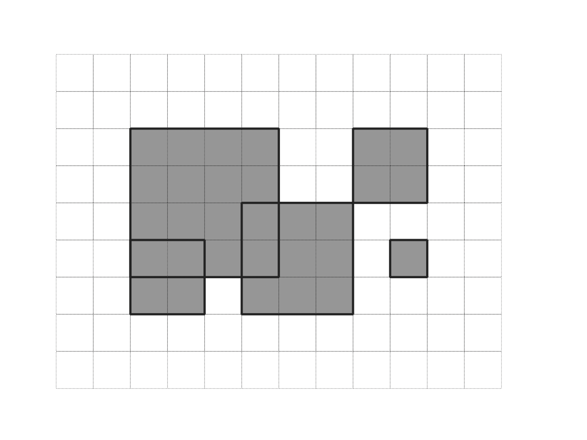

# sapmap

|BuildStatus|_

`sapmap` takes the areas that a group of people identify as important and combines them to produce a map of `spatial access priorities (SAP)`


This aggregate map is very useful in area-based planning exercises for identifying where important areas exist for a given group and for measuring the impact if changes in access are made.

And it does this without identifying the individual respondents and their areas.

Common questions these maps can answer include:
```
Which geographic areas are important to the group?  The most important?  The least important?

Is area A of more value to the group than area B?  How much more?

If the use of a given area is changed, will people be impacted?  How much of the groups value is within this area?
```

## Overview
Here's how it works at a high-level.

Assume two people draw areas important to them. Person one draws 2 polygons (in orange), and Person two draws 3 polygons (in green).


Each person has a total value of 100 that they distribute over those areas.


`sapmap` then calculates a Spatial Access Priority value for each polygon:
```
SAP value = importance / area
```

In this example, the polygon with an importance of 10 is 25 square meters per side or 625 square meters in area.  It's SAP value is calculated as:
```
10 / 625 = .016
```


The polygons are then `rasterized` or 'burned in' to a geospatial raster image (GeoTIFF).  Each pixel in a raster represents a square geographic area of consistent size.

In this example,  The pixels are 25 meters per side.



The SAP value of each pixel is then calculated as the sum of the SAP values of the overlapping polygons.  This can be displayed as a `heatmap` of importance.


The magnitude of the SAP value for each pixel is not important, only its value in relation to other pixels, and the portion of the overall value it represents.

Notice that the polygon that had an importance of 10 yields a pixel with a SAP value of 1.  This is due to it having a relatively large importance for its small area.  The sum of the values across the image is 5, so this one pixel represents 20% of the overall value.

## Reference Publications

Yates KL, Schoeman DS (2013) Spatial Access Priority Mapping (SAPM) with Fishers: A Quantitative GIS Method for Participatory Planning. PLoS ONE 8(7): e68424. [https://doi.org/10.1371/journal.pone.0068424](https://doi.org/10.1371/journal.pone.0068424)

Klein CJ, Steinback C, Watts M, Scholz AJ, Possingham HP (2010) Spatial marine zoning for fisheries and conservation. Frontiers in Ecology and the Environment 8: 349–353. Available: [https://doi.org/10.1890/090047](https://doi.org/10.1890/090047)

## Installation

`sapmap` is only available in source code form.  A Docker recipe is available to install it in an isolated virtual environment with all of its dependencies.  In the future, a published module may be made available.

1. First install and start [Docker Desktop](https://www.docker.com/) on your local computer.  Windows, MacOS, Linux are all supported.

2. Then build the sapmap image and start a container instance:
```bash
    # Clone the sapmap repo locally
    git clone https://github.com/seasketch/python-sap-map.git
    cd python-sap-map
    
    # Build the docker container
    docker-compose build sapmap
    
    # Start the docker container, attach the source code, and open a shell session inside as root user
    docker-compose run --rm --service-ports sapmap
    
    # Install sapmap module inside container, symlinking to site-packages, making it available to run
    pip install -e ./

    # Run test suite:
    pytest
```

## Example Projects

Multiple example projects are included that can be run out of the box with generated sample data.

[Simple](/examples/simple) - small geography.  Uses test dataset with polygons aligned to 100m cell boundaries.  Produces raster with 100m cell size.

[Maldives](/examples/maldives) - medium geography.  Produces ~440 MB GeoTIFF with 100m cell size.

[Canada](/examples/canada) - large geography. Produces GeoTIFF larger than 4GB with 400m cell size.

### Run the Simple Project

```
cd examples/simple
python run.py
```

## Creating a New Project

* Start with copying any of the example folders
* Copy your input shapes in
* Start with a simple config and let it use the defaults, then customize as needed.  If you don't identify a bounds it will default to the extent of the input shapes.  The pixel resolution will default to 100m.

Bounds:
* Useful [tool](https://tools.geofabrik.de/calc/#type=geofabrik_standard&tab=1&proj=EPSG:4326&places=2) to quickly identify bounds.

Random data:
* If you don't have input data then you can generate sample data using `gen_random_shapes`

## Debugging
The `examples` folder includes samples to get you started.  
Debug examples and tests within VSCode.  debupy starts in container listening on port, waits for vscode

```
    cd examples/simple
    python -m debugpy --listen 0.0.0.0:5678 --wait-for-client simple_sap_map.py
```

or

```
    cd tests
    python -m debugpy --listen 0.0.0.0:5678 --wait-for-client test_simple_sap_map.py
```

In VSCode, set a breakpoint, Click `Debug` in the left menu, then click `Python Attach`.  It will attach to the debugpy port and then execute the script

## Alternative Install

### Install and run in OSX

Install pipenv to your user home directory:

```
    pip3 install --user pipenv
```

Add user base binary directory to your PATH

```
    /Users/twelch/Library/Python/3.9/bin
```

```
    pip3 install numpy
    pip3 install --no-binary fiona rasterio shapely
```

### Install and run in Windows

* Install VS Code - https://code.visualstudio.com/Download
* Install python 3 from Windows Store if possible, otherwise use python.org.  If you use python.org be sure to 'add Python to my path' and turn off execution aliases for Python (or else it will try to open the windows store every time you run python
* Open terminal and run GitBash terminal

```
    & 'C:\Program Files\Git\bin\bash.exe'
```

Windows Option 1: Docker

Install and start Docker for Windows, then build and start a sapmap Docker image:

```
    git clone https://github.com/seasketch/python-sap-map.git
    cd python-sap-map
    docker-compose build debug # not necessary?
    docker-compose run --rm --service-ports sapmap
```

Windows Option 2: Python virtual environment

```
    pip install virtualenv
    virtualenv env-sapmap
    source env-sapmap/Scripts/activate
    pip install --upgrade pip
```

Follow the rasterio windows instructions - https://rasterio.readthedocs.io/en/latest/installation.html#windows
Pointed to install GDAL and Rasterio wheels from https://www.lfd.uci.edu/~gohlke/pythonlibs/#gdal.  Look for the latest win_amd64:

```
    pip install .\GDAL-3.3.1-cp39-cp39-win_amd64.whl
    pip install .\rasterio-1.2.6-cp39-cp39-win_amd64.whl
    pip install -r requirements.txt
    pip install -r requirements_dev.txt
```

deactivate the virtual Python environment when done, activate again when needed, or delete

```
    deactivate
```

