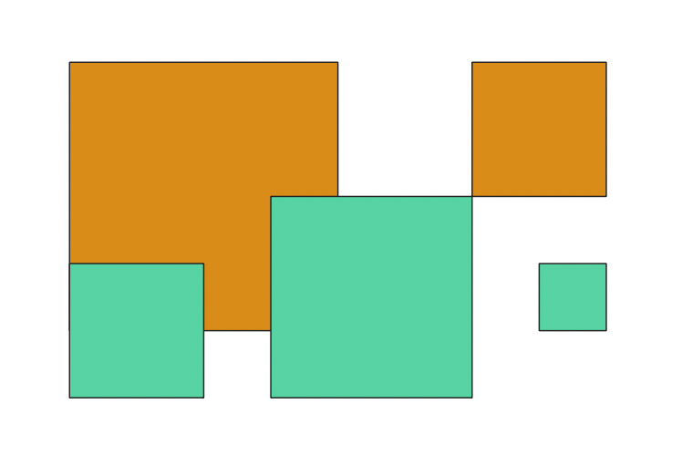
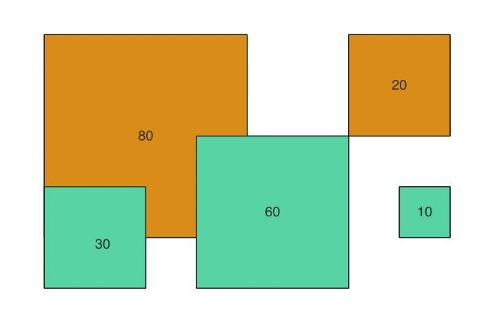
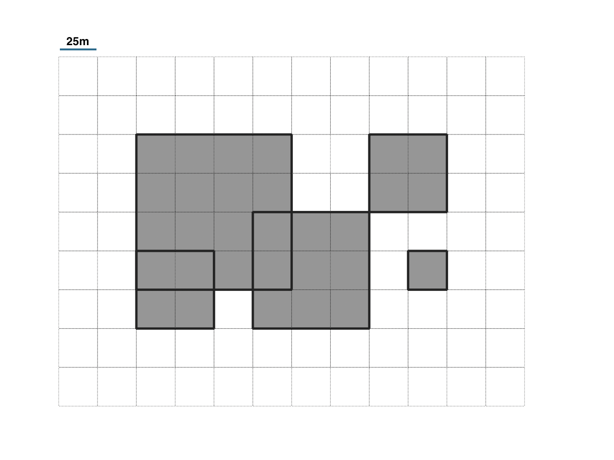
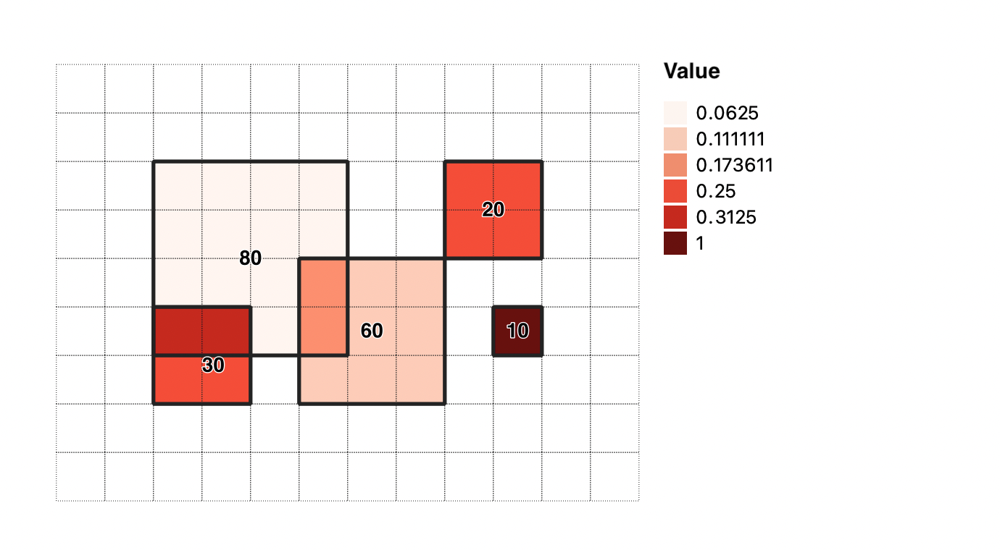

# Algorithm Overview

## Count

Method: `count`

## Spatial Access Priority (SAP) heatmap

Method: `sap`

Assume two people draw areas important to them. Person one draws 2 polygons (in orange), and Person two draws 3 polygons (in green).



Each person has a total value of 100 that they distribute over those areas.



The `sap` method then calculates a Spatial Access Priority value for each polygon:

 

In this example, the polygon with an importance of 10 is 25 square meters per side or 625 square meters in area.  It's SAP value is calculated as:
```
10 / 625 square meters = .016 / square meters
```

This can be read as `.016 per square meter`.  In other words, the value or importance is spread over the area equally.


The polygons are then `rasterized`, by overlaying them with a rectangular grid of pixels and combining their values.  The discrete nature of polygons are traded for the ability to represent the importance of areas as a continuous field, sampled at the rate of once per grid pixel.  The smaller the grid pixels are, the more it retains the original accuracy of the polygons.  In this example, each grid pixel represents a 25 meter x 25 meter geographic area.



One-by-one, each rasterized polygon is `burned-in` to the grid, producing a `heatmap` or aggregate sum of SAP value.  



More specifically, for each pixel that a polygon overlaps with, the SAP value of the polygon is assigned to that pixel.  The accumulated SAP values for each pixel are summed to produce a final grid, which is output as a geospatial raster image file (GeoTIFF).

Notice that the small polygon that had an importance of 10 and a SAP value of .016, results in a pixel SAP value of .016.  The sum of all pixel values in the image is 0.32, so this one pixel (and its geographic area) represents `(.016 / .32) = 5%` of the overall value or importance.

On the far left side, you'll see that polygons with SAP values of .008 and .012 produce pixels with a SAP value of `.008 + .012 = .02` where they overlap.  These pixels have the highest overall importance as a result.

### Map Interpretation

The magnitude of a pixels value by itself (e.g. `.02`)  is not important.  The real value is in being able to compare one pixel to another.  You can even compare the combined value of a group of pixels to another group of pixels.  A higher value means more importance to the group.  And the loss of access to a geographic area with more value will have a greater `cost` to the group.

For this reason, Spatial Access Priority maps are frequently used as a `cost` layer in prioritization software such as [Marxan](https://marxansolutions.org/) or [PrioritizR](https://prioritizr.net/), to find spatial planning solutions that maximize for certain factors such as ecological abundance or resilience, while minimizing the cost to groups of people that use the area.

### Advanced Calculation

Extra parameters are provided for some advanced calculations.  Review the research literature for more detailed descriptions and use cases.  See the API docs for usage.

`areaFactor` - By default the planning units are in meters, which can produce very small SAP values because the denominator is so large.  An areaFactor can be used to linearly scale the area to offset this.  The default value is 1.

`importanceFactor` - If a group of polygons should be given more or less importance than others, then an importanceFactor can be used.  The default value is 1.  For example if the polygons (together adding up to 100 importance) represent a person that uses an area only half of the year and it is decided that their areas should therefore have half the importance, then a factor of 0.5 can be given.  Or if the polygons represent the areas and importance of 10 people responding together as group, where other responses only represent a single person, then an importanceFactor of 10 can be assigned.

This more robust and flexible SAP calculation becomes:

 
